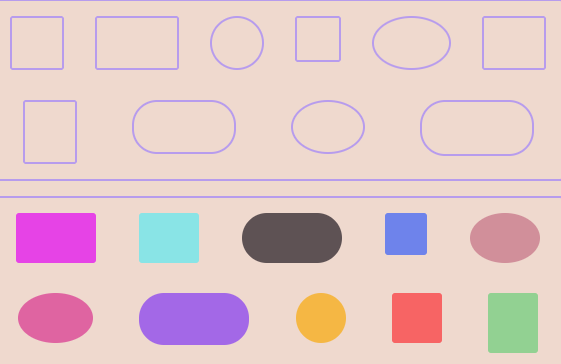

Shape Drop is a simple game where players drag colorful geometric shapes and drop them into matching holes developed using the HTML Drag and Drop API

Source: <a href="https://mazik0.github.io/Shape-Drop-Game/"><i class="large github icon "></i>mazik0/shape-drop</a>
